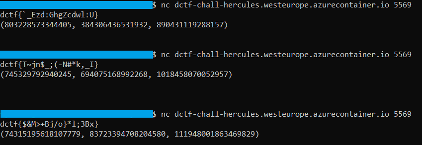
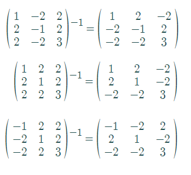

## Hercules

A mathematical one.

## Analysis

After connecting, the program exits almost immediately, only printing two lines…

...that are somewhat randomized each time. 

The first line is probably the encrypted flag, and retrieving the original seems to be the objective. The trio of large numbers is daunting, and the challenge description is vague, so let’s just open up the binary in Ghidra.

The file is stripped, but we can find our `main` by looking inside the `entry` function:

(Renaming functions and variables as we go, for clarity.)

The hardcoded bytes immediately stand out as a char array. There are better ways to decipher this, but if Ghidra isn't feeling up to it, throwing them into any hex-to-ASCII works fine:

This proves to be too easy, of course:

Worth the shot.

The real flag is in the executable running on the server, and we need to learn how to decrypt its output.

We can see that `main` calls a new function with `0x19` and the flag as its parameters:

That's a lot of variables. However, we may notice that the ones in lines 27-29 actually form an array, which the decompiler hasn't recovered properly. Reading line 65 gives a clue to that, as
`local_88`, which holds the address of the first variable, is accessed as `local_88[1]` and `local_88[2]`, and reading the disassembly confirms these suspicions.

Similarly, `local_58` seems to be the start of an array of 9 variables.

We can make the important part of the function more legible:

All that happens is that one of `f0`, `f1` and `f2` is randomly selected and called with the larger array as parameter, followed by two more functions. (Ignore the fact
that those seemingly have three arguments here, that is a decompiler artifact. It is later clear that they only take two.) From `main`, we know that this is repeated `25` times. After that, the encrypted flag is printed, followed by the smaller array.

Comparing this to the output of the binary, it seems that `fun3` must be the one encrypting the flag, while `fun2` is probably making the inital `{3,4,5}` array larger.

Let's analyze `f0, f1, f2` first:

It looks rather disgusting at first, but after some renaming, and retyping the function argument from `long` to the `long*` that we know it accepts:

Another look at the arithmetic involves suggests that our array is better interpreted as a 3x3 matrix. We see that `f0` makes sure the second column of the matrix turns negative, and the other two are positive.

The other two functions perform similar tasks (with `arr9` renamed to `matrix` for clarity):

`f1` is turning every column positive, while `f2` is making only the first column negative. 
Therefore, here are our matrices after `f0`, `f1` and `f2`, respectively:

Continuing to `fun2`:

The important part, after retyping the parameters and beautifying:

For each `i`-th column in the matrix, calculate some `operation` and write it in the `i`-th entry of a new array? This looks suspiciously like matrix multiplication.

Yep, `operation` is nothing more than scalar product. So, this function takes our triplet of numbers, and multiplies it with a random one of our matrices.

Let's look at the final function:

It seems to be a simple shift cipher, shifting the value of every character in the flag by the value of the corresponding number in the array. The arithmetic with `0x5f` and `0x7e` suggests it cycles around the printable characters.

## Solution

Now, to recap how the entire program works:
- We begin with our flag and the array {3,4,5}.
- A loop is repeated 25 times, where:
  - The array is multiplied with a randomly selected matrix out of the three known.
  - The array is used as a key to encrypt the flag.
- The encrypted flag and final array are then given to us. 

We can't do much magic with /dev/urandom, but we don't have to - there are "only" 3^25 different ways that these matrices may be selected, and that is bruteforcable.

However, in the spirit of `From his foot, we can measure him`, some might find the following solution a bit more beautiful:

Let us assume that the challenge author is not evil, and there really is a way to determine the entire sequence of matrices involved, from the final one given.

By definition, the way to go about reversing matrix multiplication is finding the inverses:

They do look similar. But which inverse is the correct one to use? Bruteforcing all the inverses to find what sequence brings us back to {3,4,5} could again take as much as 3^25 tries, unless... 

...they do not need to be bruteforced. This is what happens if we actually try to multiply the final triplet with every inverse (in a software capable of handling such large numbers, of course). Notice that the results are numerically identical, differing only by +/- signs. 

We can now see that `f1` was the last matrix to have been used on this array, because its inverse is the only one that returned a parent triplet with all elements positive. This is becaue no matter what sequence of matrices is applied on `{3,4,5}`, with none of them are we able to produce a negative number. Therefore, the first and third result couldn't have been part of our sequence, and continuing to branch out from them is going to give us false results.

If we wanted to, we could now backtrack every triplet by trying each of the inverses, selecting the one with the positive result, and from that determine exactly what sequence of matrices created it from the base `{3,4,5}` array. The easiest exploit, however, simply hardcodes one of the inverses, and makes sure to turn all values in the result positive after doing the multiplication:

The main idea is in the `driver` function. `multiplication` and `scalar` work the same as those in the decompilation, and `decrypt` is, obviously, doing the reverse of what the encrypting function is doing. 

(Maybe one could attempt to do this in a language that isn't C for a sexier solution, but oh well.)

Those Pythagorean triplets look pretty damn beautiful, though, don't they?

[(Link to the concept used)] (https://en.wikipedia.org/wiki/Tree_of_primitive_Pythagorean_triples)

#### flag = `dctf{x_p3de_herc00lem}`
